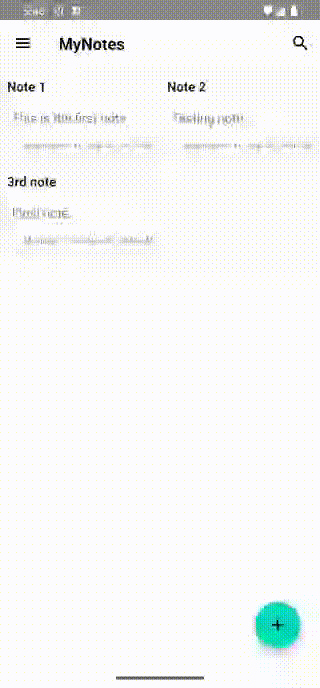

<h2 align="center">
    
    <br />
    <b>MyNotes - Secure backup using AES 256-bit encryption</b>
</h2>

<div align="center">
    <h4><b>You can get MyNotes app from one of the links below!</b></h4>
    <a href="https://play.google.com/store/apps/details?id=com.dinesh.mynotes">
        
    </a>
    <a href="https://github.com/Dinesh2811/MyNotes/releases/latest">
        
    </a>
</div>

### Overview
MyNotes is a lightweight open-source Android app designed for easy note-taking, secure data storage, and effortless backup and restore options. With AES 256-bit encryption, you can keep your notes safe and private. The app utilizes LiveData, ViewModel, Coroutine, and Room Database for a seamless
and responsive user experience.

## Screenshots

<table>
  <tr>
    <td></td>
    <td></td>
    <td></td>
  </tr>
  <tr>
    <td></td>
    <td></td>
    <td></td>
  </tr>
</table>

## Demo Video




### Features
- Create, edit, update, and delete notes effortlessly.
- Local backup and restore options for your notes.
- Encrypt your backups using AES 256-bit encryption for added security.
- Perform full-text searches to find notes quickly.
- Built using modern Android development tools and architecture, including LiveData, ViewModel, Coroutines, and Room database.

## Contribution
Whether you're looking to offer your expertise, suggest improvements, report issues, or ask questions, your involvement is highly valued and much appreciated. Any kind of contributions from the community are most welcomed.

#### Here's how you can contribute:

- #### Report Issues:
  If you come across any bugs, glitches, or unexpected behavior, please report them using the GitHub issue tracker. Be sure to provide detailed steps to reproduce the issue and any relevant information.

- #### Submit Pull Requests:
  Have a fix or enhancement in mind? You can submit pull requests with your proposed changes. We'll review them and work together to integrate valuable additions into the library.

- #### Share Ideas:
  Have ideas for new features or improvements? Feel free to open discussions in the GitHub repository. Your input can help shape the future of EasyPermissionRequest.

## Spread the Word
If you find MyNotes app useful, consider sharing it with fellow developers and communities.

## Third-Party Dependencies

The project utilizes various third-party libraries to enhance functionality. Here are some of the key dependencies:

- **[com.google.code.gson:gson](https://github.com/google/gson)** - Used for JSON serialization ([Apache License 2.0][7])
- **[com.journeyapps:zxing-android-embedded](https://github.com/journeyapps/zxing-android-embedded)** - QR-Code library ([Apache License 2.0][7])

Please note that this list includes only a subset of the third-party libraries used in the project. Additionally, the project relies on other standard AndroidX and Kotlin libraries, which are not listed here for brevity. You can review the `build.gradle` file for a complete list of dependencies.

## License

MyNotes is licensed under the terms of the [Apache License 2.0][7]. See [License](LICENSE) for details.

```
   Copyright 2023 Dinesh K

   Licensed under the Apache License, Version 2.0 (the "License");
   you may not use this file except in compliance with the License.
   You may obtain a copy of the License at

       http://www.apache.org/licenses/LICENSE-2.0

   Unless required by applicable law or agreed to in writing, software
   distributed under the License is distributed on an "AS IS" BASIS,
   WITHOUT WARRANTIES OR CONDITIONS OF ANY KIND, either express or implied.
   See the License for the specific language governing permissions and
   limitations under the License.
```

[7]: https://www.apache.org/licenses/LICENSE-2.0

### Happy note-taking with MyNotes!